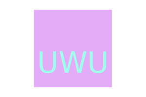

# Module 10 SVG file Generator

## Table of Contents
  * [Description](#description)
  * [Installation](#installation)
  * [Usage](#usage)
  * [Licenses](#license)
  * [Contributing](#contributing)
  * [Tests](#tests)
  * [Questions](#questions)
  * [Credits](#credits)
    
## Description
This application is for people who wish to generate their own logo without having to hire a graphic designer. The designs available at the moment is limited to three shapes (circle, square, triangle) and up to three characters. For special characters, most are valid but using '&' will break the design. Please avoid using '&'. Color hexadecimal code can be taken from visiting https://htmlcolorcodes.com/

## Installation
Please do a npm installation prior to running the script.
`npm i inquirer@8.2.4`
and
`npm i fs`
Recent version of inquirer will not work with this tool.

## Usage
Sample video link:

## Credits
* Sample: https://github.com/ThomasCalle/Thomas-Object-Oriented-Programming-SVG-Logo-Maker

## License
MIT License

## Contributing
Feel free to clone or fork the repo and create any changes you wish to make the application better!

